# Training-Custom-Object-Detector-with-Tensorflow-2.X

Bu repoda, Tensorflow-gpu 2.X ile kendi özel Tensorflow Nesne Detektörümüzü nasıl eğitebiliriz :question: sorusuna cevap verilecektir:blush:.  

Tensorflow Nesne Detektörü API'si ile özel bir nesne tanıma modeli eğitmek için izlememiz gereken adımlar şunlardır :point_right:  

1. Anaconda Kurulumu ve Sanal Ortamı Oluşturma  
2. TensorFlow GPU Kurulumu  
3. Çalışma Ortamı Hazırlama  
4. COCO API Kurulumu
5. Nesne Tanıma API'si Kurulumu
6. İnternet'ten Verileri (görüntü) Toplama
7. Eğitim için  Verilerimizi Etiketleme
8. Modeli Yapılandırma
9. Modeli Eğitme
10. Tensorboad ile Eğitim Sürecini İzleme
11. Eğitilmiş Modelimizin Çıkarım Grafiğini Dışa Aktarma
12. Modeli Değerlendirme

Bu repoda, sadece tek bir sınıf (trafik arabaları tanıma) için model eğiteceğiz.  
Ama bu adımları takip ederek birden fazla sınıf için de model eğitilebilecektir.  
Araba tanımı ile ilgili kullanılan veri seti, repoda tüm gerekli formatlarda paylaşılacaktır.  
Pratik yapma amacıyla bu repoyu kullanıyor olup, veri toplama ve/veya hazırlama ile uğraşmak  
istemeyen  herkes paylaşılan verileri kullanabilecektir :ok_hand:.  

## Sistem Gereksinimleri
Eğitim için kullandığımız sistemin özellikleri, eğitim sürecimizi çok etkilemektedir.
Örnek olarak eğitim süresi, eğitim performansı, vs. söyleyebiliriz.  
Eğitim için benim kullandığım sistemin özellikleri şunlardır:  
- OS Linux / Ubuntu 18.04.4 LTS (Bionic Beaver)
  **Komut** ```cat /etc/os-release```  
- Intel(R) Xeon(R) Gold 6130 CPU @ 2.10GHz
  **Komut** ```lscpu | grep Model\ name```  
- Tesla V100-PCIE-32GB DDR4  Grafik Bellek Kartı
  **Komut** ```nvidia-smi -q | grep 'Product Name'```
  **Komut** ```sudo dmidecode | grep DDR```
- Belek Cihazı 32GB  
  **Komut** ```sudo dmidecode -t 17 | grep Size:```
<br />

Tensorflow API'si ile model eğitmenin iki (2) tane yolu vardır.  
Birincisi ve burada kullanacağımız yöntem, [tensorflow-gpu](https://pypi.org/project/tensorflow-gpu/)'yu kullanarak model eğitme yöntemidir.  
Bunu yapmak için  uygun GPU'nun (CUDA özellikli GPU) bulunması yanında NVIDIA Grafik Kartı sürücüleri,  
CUDA Toolkiti ve  NVIDIA cuDNN  kütüphanesinin kurulu olmaları gerekmektedir.  
CUDA Toolkiti ile ilgili fazla bilgi edinmek için [CUDA dokümantasyona](https://docs.nvidia.com/cuda/cuda-toolkit-release-notes/index.html) bakabilirsiniz.    

<p>
   &nbsp;&nbsp;
  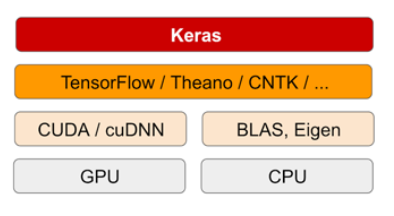
</p>

İkinci yöntem ise [tensorflow-cpu](https://pypi.org/project/tensorflow/)'yu kullanarak model eğitme yöntemidir.  Ama bu anlatımda ona ilişmeyeceğiz.  

## Adımlar
### 1. Anaconda kurulumu ve Sanal Ortamı oluşturma  
Anaconda, model eğitimi için sanal ortamı oluşturup gerekli yazılım paketlerini kuracağımız platformdur.  
Eğer bilgisayarınızda anaconda kurulu değilse anaconda yazılımını kendi resmi [sitesinden](https://www.anaconda.com/products/individual) indirip bu  
[sayfayı](https://docs.anaconda.com/anaconda/install/) takip ederek kullandığımız sisteme göre kurulumu gerçekleştirebilirsiniz:yum:.  


Anaconda prompt'ta şu adımları izliyoruz:  

**Sanal ortamı oluşturma**  
 ```
  conda create --name tensorflow pip python=3.8.5
 ```  
**Sanal ortamı aktifleştirme**
```
  conda activate tensorflow
```  
**Not:**  
&nbsp;&nbsp;&nbsp;&nbsp;sanal ortamı istediğiniz dizinde terminal açıp oluşturabiliriz, fark etmeyecektir.  
&nbsp;&nbsp;&nbsp;&nbsp;Ama kullanabilmek için yukarıdaki komut ile aktifleştirmemiz gerekmektedir.  

### 2. TensorFlow GPU Kurulumu
Bir önceki adımda Anaconda'yı kurduk ve sanal ortamı oluşturup aktifleştirdik.  
Şimdi oluşturduğumuz sanal ortamda tensorflow-gpu dahil olmak üzere gerekli bütün yazılım paketlerini kuracağız.  
**Not:**  
&nbsp;&nbsp;&nbsp;&nbsp;Daha önce bahsettiğimiz gibi tensorflow-gpu, CUDA Toolkiti ve  NVIDIA cuDNN kütüphanesini gerektirmektedir.  
&nbsp;&nbsp;&nbsp;&nbsp;Bunlar GPU grafik belleği kullanmak için gerekli araç ve kütüphanelerdir. Ama bu anlatımda bunların nasıl  
&nbsp;&nbsp;&nbsp;&nbsp;kurulacağına girmeyeceğiz. Kurumlar ile ilgili bu [sayfa](https://docs.nvidia.com/deeplearning/cudnn/install-guide/index.html) yardımcı olacaktır:wink:.  
<br/>
Anaconda prompt'ta:  
```
pip install tensorflow-gpu
```   
Eğer tensorflow-gpu'nun belirli bir versyonu kurmak istiyorsak prompt komutta böyle belirleyebiliriz.  
```
pip install tensorflow-gpu==versyon_numarası
```
Buradan [tensorflow-gpu](https://pypi.org/project/tensorflow-gpu/) sürümlerine bakabilirsiniz.  
<br />
Sonradan tensorflow kurulu olup olmadığı ve/veya hangi versyonu kurduğumuz kontrol etmek için terminalde,  
```
python3 -c 'import tensorflow as tf; print(tf.__version__)'
```
komutunu çalıştırabiliriz.  

Her şey yolunda ise çıktı olarak belirlediğiniz tensorflow versyonu aksi taktirde python sürümünüze göre  
tensorflow' nun son versyonu alırsınız. Örneğin "2.3.0".  
Mevcut GPU cihazlarını görüntülemek için python promptta bu scripti çalıştıralım  
```
>>> import tensorflow as tf
>>> print(tf.config.experimental.list_physical_devices('GPU'))
```
> **Çıktı örneği:** `"PhysicalDevice(name='/physical_device:GPU:0', device_type='GPU')"`  

Tensorflow GPU kurulumu ile ilgili fazla bilgi edinmek için [TensorFlow sitesine](https://www.tensorflow.org/install/gpu) bakabiliriz.  
Bende kurulu olan ana yazılım paketleri:  
- NVIDIA CUDA 10.1     
- NVIDIA cuDNN 7.6.5  
- tensorflow 2.3.0  
- tensorflow-gpu 2.3.0  

Diğer versyonlar için [CUDA Arşiv](https://developer.nvidia.com/cuda-toolkit-archive) ve [cuDNN Arşiv](https://developer.nvidia.com/rdp/cudnn-archive)'lerine bakabilirsiniz.  

### 3. Çalışma ortamı hazırlama

Şimdi gerekli kurulumları tamamladıktan sonra git reposundan Tensorflow API'sini indirip çalışma ortamımızı hazırlayalım.  
TensorFlow Nesne Detektörü API'sini kullanarak model eğitmek için dizinleri uygun bir şekilde yapılandırmamız gerekmektedir.  
Bu repodan dizinlerin yapılandırılmış halini klonlayabilirsiniz.  
İlk olarak masaüstünde **TensorFlow** adıyla bir dizini oluşturalım ve dizin içine gidelim.  
```
cd ~/Desktop/
mkdir TensorFlow
cd TensorFlow
```
Burada kolaylık olsun diye masaüstünde dizinimizi oluşturduk. Dizinimizi herhangi bir dizinde oluşturabiliriz.  
Ama daima dizin yoluna dikkat etmemiz gerekecektir. Sonradan TensorFlow dizinimizin içinde TensorFlow models Reposunu klonlayalım.  
```
git clone https://github.com/tensorflow/models.git
```
Sonra aynı dizinde bu scripti çalıştırarak 2. repoyu da indirip çıkartalım.
```bash
 wget -O training_files.zip https://github.com/mohamedlassine97/Training-Custom-Object-Detector-with-Tensorflow-2.X/archive/master.zip
 unzip training_files.zip 
 cp -r Training-Custom-Object-Detector-with-Tensorflow-2.X-master/workspace/ .
 rm -r *master *.zip
```
Ardından dizin yapımız böyle gözükmelidir.
```TensorFlow/
└─ models/
   ├─ community/
   ├─ official/
   ├─ orbit/
   ├─ research/
└─ workspace/
   ├─ training_demo/
```
Dosya yapılandırmaları gerçekleştirdikten sonra, Nesne Tanıma API'si için gereksinimleri kurmamız gerekmektedir.  
İlk önce **protobuf** compiler'i kuralım.  
```
conda install -c anaconda protobuf
```
Sonradan TensorFlow/models/research dizinine gidelim :arrow_right:

```
cd ~Desktop/Tensorflow/models/research
```
Ardından **protos**'u derleyelim  
```
protoc object_detection/protos/*.proto --python_out=.
```

Sonradan terminali kapatıp yeniden açıyoruz ve TensorFlow dizine gidip sanal ortamımızı etkinleştiriyoruz.  
```
cd ~/Desktop/Tensorflow
conda activate tensorflow
```
### 4. COCO API'si Kurulumu :alien:
TensorFlow 2.X için Nesne Tanıma API'sinin başka bir gereksinimi ise pycocotools araçlarıdır.  
```
pip install cython
git clone https://github.com/cocodataset/cocoapi.git
cd cocoapi/PythonAPI
make
cp -r pycocotools  ../../models/research/
```
Şimdi bakalım Tensorflow dizinimizin yapısı nasıl gözüküyor.  
```
tree -d -L 2 
``` 

Her şey yolundaysa böyle gözükmelidir :v::v::v: 

``` 
└─ cocoapi/
   ├─ common/
   ├─ LuaAPI/
   └── …
└─ models/
   ├─ community/
   ├─ official/
   ├─ orbit/
   ├─ research/
└─ workspace/
   ├─ training_demo/  
``` 

<p align=Center>
    
</p>
<br/>


### 5. Nesne Tanıma API'si Kurulumu :alien:
Bu adım kurulumların son adımıdır. Şimdi Nesne Tanıma API'sinin kendisini kuralım.  
TensorFlow/models/reasearch dizinine gidelim.  
```
cd ~/Desktop/TensorFlow/models/research
```
Ve bu komutları çalıştırarak kurulumu gerçekleştirelim.  
```
cp object_detection/packages/tf2/setup.py .
python -m pip install .
```
Herhangi bir hata alırsanız :-1:, hatayı bildirebilirsiniz :+1: , büyük ihtimal ile hata pycotools aracının yüklenmesiyle ilgilidir.  
Ama eğer herhangi bir hatayla karşılaşmadıysanız :wave: modelinizi altaki :point_down: komutla test edebilirsiniz.  
```
python3 object_detection/builders/model_builder_tf2_test.py
```
```
INFO:tensorflow:time(__main__.ModelBuilderTF2Test.test_create_ssd_models_from_config): 23.55s
I0125 14:18:21.078821 139913358449536 test_util.py:1972] time(__main__.ModelBuilderTF2Test.test_create_ssd_models_from_config): 23.55s
[       OK ] ModelBuilderTF2Test.test_create_ssd_models_from_config
[ RUN      ] ModelBuilderTF2Test.test_invalid_faster_rcnn_batchnorm_update
INFO:tensorflow:time(__main__.ModelBuilderTF2Test.test_invalid_faster_rcnn_batchnorm_update): 0.0s
I0125 14:18:21.089369 139913358449536 test_util.py:1972] time(__main__.ModelBuilderTF2Test.test_invalid_faster_rcnn_batchnorm_update): 0.0s
[       OK ] ModelBuilderTF2Test.test_invalid_faster_rcnn_batchnorm_update
[ RUN      ] ModelBuilderTF2Test.test_invalid_first_stage_nms_iou_threshold
INFO:tensorflow:time(__main__.ModelBuilderTF2Test.test_invalid_first_stage_nms_iou_threshold): 0.0s
I0125 14:18:21.091062 139913358449536 test_util.py:1972] time(__main__.ModelBuilderTF2Test.test_invalid_first_stage_nms_iou_threshold): 0.0s
[       OK ] ModelBuilderTF2Test.test_invalid_first_stage_nms_iou_threshold
[ RUN      ] ModelBuilderTF2Test.test_invalid_model_config_proto
INFO:tensorflow:time(__main__.ModelBuilderTF2Test.test_invalid_model_config_proto): 0.0s
I0125 14:18:21.091690 139913358449536 test_util.py:1972] time(__main__.ModelBuilderTF2Test.test_invalid_model_config_proto): 0.0s
[       OK ] ModelBuilderTF2Test.test_invalid_model_config_proto
[ RUN      ] ModelBuilderTF2Test.test_invalid_second_stage_batch_size
INFO:tensorflow:time(__main__.ModelBuilderTF2Test.test_invalid_second_stage_batch_size): 0.0s
I0125 14:18:21.092899 139913358449536 test_util.py:1972] time(__main__.ModelBuilderTF2Test.test_invalid_second_stage_batch_size): 0.0s
[       OK ] ModelBuilderTF2Test.test_invalid_second_stage_batch_size
[ RUN      ] ModelBuilderTF2Test.test_session
[  SKIPPED ] ModelBuilderTF2Test.test_session
[ RUN      ] ModelBuilderTF2Test.test_unknown_faster_rcnn_feature_extractor
INFO:tensorflow:time(__main__.ModelBuilderTF2Test.test_unknown_faster_rcnn_feature_extractor): 0.0s
I0125 14:18:21.094032 139913358449536 test_util.py:1972] time(__main__.ModelBuilderTF2Test.test_unknown_faster_rcnn_feature_extractor): 0.0s
[       OK ] ModelBuilderTF2Test.test_unknown_faster_rcnn_feature_extractor
[ RUN      ] ModelBuilderTF2Test.test_unknown_meta_architecture
INFO:tensorflow:time(__main__.ModelBuilderTF2Test.test_unknown_meta_architecture): 0.0s
I0125 14:18:21.094371 139913358449536 test_util.py:1972] time(__main__.ModelBuilderTF2Test.test_unknown_meta_architecture): 0.0s
[       OK ] ModelBuilderTF2Test.test_unknown_meta_architecture
[ RUN      ] ModelBuilderTF2Test.test_unknown_ssd_feature_extractor
INFO:tensorflow:time(__main__.ModelBuilderTF2Test.test_unknown_ssd_feature_extractor): 0.0s
I0125 14:18:21.095142 139913358449536 test_util.py:1972] time(__main__.ModelBuilderTF2Test.test_unknown_ssd_feature_extractor): 0.0s
[       OK ] ModelBuilderTF2Test.test_unknown_ssd_feature_extractor
----------------------------------------------------------------------
Ran 20 tests in 28.457s
```

<p align=Center>
	Böyle bir çıktı aldıysanız tebrikler. <br/>
    
</p>
<br/>

### 6. İnternet'ten Verileri (görüntü) Toplama

TensorFlow API'si test ettikten sonra modelimizi eğitmek üzere internet üzerinden sınıfımızın görüntülerini topluyoruz.  
İnternette sınıfımıza uygun görüntü veri setleri de bulabiliriz.  
Bu repodaki verileri kullanmak isteyenler bu adım ve sonraki adım olan label işlemlerini geçebilir.  
**:bangbang: Not:** Topladığımız verileri bir sonraki adımda etiketleyip TFRECORD dosyasını çıkartacağız ve model eğitirken bu   
TFRECORD dosyasını kullanacağınız. Ve TFRECORD dosyası ile ilgili en çok alınan hatalardan bir tanesi görüntü tipi hatasıdır.  
Yani TFRECORD \[PNG, JPEG, vs.] gibi görüntü için doğru çıktı üretmiyor. Dolayısıyla kendi verinizi toplamaya karar verirseniz  
toplanan verilerin .jpg görüntüleri olmasına dikkat etmelisiniz. Fazla bilgi için bu [bildirime](https://github.com/tensorflow/tensorflow/issues/13044) bakabilirsiniz.
<br />
Hatırlıyorsak **Çalışma ortamı hazırlama** adımında çalışma ortamımızı hazırlamıştık.  
Şimdi bu adımda lazım olacak olan tüm dosyalar *```workspace/training_demo```* dizini altında olacaktır.  
Bu dizinin yapısına bakalım:  
```
└─ training_demo/  
   ├── annotations
   ├── exported-models
   ├── images
   │   ├── test
   │   └── train
   ├── models
   └── pre-trained-models
```
Bu dizinlerin ne işe yaradığından biraz bahsedelim  

- ```annotations:``` Bu dizin, modelimiz için lazım olan tüm verileri saklayacağımız dizindir.  
 Bu dizinde eğitim hattı için gerekli olan RECORD ve PBTXT dosyaları bulunmaktadır.   
 Kendi veri setinizi eğitiyorsanız, train.record, test.record ve label_map.txt dosyalarını silip  
 veri setinizin train.record, test.record ve label_map.pbtxt dosyalarını koymalısınız.    
 Ancak Araba veri setini eğitiyorsanız bu dosyaları kullanmak üzere devam edebilirsiniz.   
 - ```exported-models:``` Bu, çıkarım grafiğimizi dışa aktaracağımız ve saklayacağımız çıktı dizinidir.  
 - ```images:``` Bu, train ve test görüntülerimizin yer alacağı dizindir.    
 - ```models:``` Bu dizinde, eğitim iş hattımız ve kontrol noktası bilgilerimizin yanı sıra eğitim için  
 gereken CONFIG dosyasını saklayacağız.  
 - ```pre-trained-models:``` Burada eğitim için başlangıç kontrol noktası olarak kullanacağımız önceden eğitilmiş  
 modelimizi saklayacağız.  
 - Geri kalan betik kodları, modeli eğitmek ve dışa aktarmak içindir ve ayrıca bir test görüntüsü üzerinde  
 çıkarım yapan bir nesne tanıma betik kodu örneği de mevcuttur.  
 <br />
 
Kendi özel veri setimiz üzerinde model eğitmek istiyorsak önce görüntüleri toplamalıyız.  
Örnek olarak diyelim 2 tane sınıf ve her sınıf için 100 tane görüntü kullanmak istiyoruz.  
Bu iki sınıf elma ve portakal olsun. 100 tane elma ve 100 tane portakal toplamda 200 tane görüntü toplamamız gerkmektedir.  
Bu eğitim için yaklaşık 1000 tane göürüntü kullanılmaktadır.  
Bu veri sayısı tamamen size bağlıdır, ama aklımda veri sayısının modelimizin performansını etkikeyeceğini tutarak yeterince veri toplamalıyız.  
**Örnek Görüntüler**  
**Örnek Görüntüler**
**Örnek Görüntüler**

Görüntüleri topladıktan sonra verilerimizin %80'i train veri seti %20'si ise test veri seti olarak ayırıyoruz.  
Train görüntüleri images/train test görüntüleri ise images/test dizinlere yerleştiriyoruz.  

### 7. Eğitim için Verileri Etiketleme 
Bir önceki adımda veri toplama ve ilgili dosyalara ayırmadan bahsettik. Bu adımda Train ve Test olarak ayırdığımız  
görüntüleri nasıl etiketleyebileceğimiz :question: ve veri dosyalarını istediğimiz :question: formatlardan nasıl elde edebiliriz ? sorularına cevap vereceğiz:blush:.  
Bu anlatımda etiketleme işlemi için web-tabanlı bilgisayarla görü açıklama aracı olan [CVAT](https://software.intel.com/content/www/us/en/develop/articles/computer-vision-annotation-tool-a-universal-approach-to-data-annotation.html)'ı kullanacağız.  
Kaynakların çoğunda etiketleme işlemi için [LabelImg](https://tzutalin.github.io/labelImg/) kullanılmaktadır.  
Ama bu anlatımda CVAT kullanmanın sebebi görüntülerimizi etiketledikten sonra verilerimizi doğrudan .record formatında  indirebiliriz.  
Dolayısıyla verileri önce xml dosya olarak indirip sonra RECORD dosyasına çevirme gibi dertlerden kurtuluruz.    
CVAT kullanımının ayrıntılarına girmeceğez. Bilgi edinmek isteyen bu [siteyi](https://blog.roboflow.com/cvat/) ziyaret edebilir.  

**TODO:** Label Örnek 2 tane  foto
**TODO:** Label Örnek 2 tane  foto

Etiketleme işlemi bitirdikten sonra Train ve Test verilerimizi CVAT'ın Actions -> Export as a dataset seçeneğinden *TFRECORD 1.X* olarak  
indiriyoruz. Sonradan indirdiğimiz zip dosyası içerisindeki *TFRECORD* dosyaları ve PBTXT dosyasını **workspace/training_demo/annotations** 
dizinine çıkartıyoruz. *TFRECORD* dosyaları default adıyla indirildiğinden dolayı dosyaları train dosyası train.record test dosyası da  
test.record olarak yeniden adlandırıyoruz.  
PBTXT dosyası etiketlediğimiz sınıfların idleri ve adlarını içermektedir. Burada sadece tek bir sınıfımız olduğu için içeriği böyle gözükmektedir.
```
item {
	id: 1
	name: 'vehicle'
}
```
Örneğin boat adında ikinci bir sınıfımız olsaydı PBTXT dosyasının içeriği böyle olacaktı.  
```
item {
	id: 1
	name: 'vehicle'
}
item {
	id: 2
	name: 'boat'
}
```

### 8. Modeli Yapılandırma  
#### 8.1 Önceden eğitilmiş modeli indirme 
Bu eğitim için TensorFlow'nun önceden eğitilmiş modellerinden birinin CONFIG dosyasını kulllanacağız.  [TensorFLow Model Zoo](https://github.com/tensorflow/models/blob/master/research/object_detection/g3doc/tf2_detection_zoo.md)'da TensorFlow'nun önceden eğitilmiş bir sürü modelleri vardır, ama biz bu eğitimde, iyi performansla yelpazenin daha hızlı ucunda olduğu için  
[SSD MobileNet V2 FPNLite 640x640](https://www.google.com/searchq=SSD+MobileNet+V2+FPNLite+640x640&oq=SSD+MobileNet+V2+FPNLite+640x640&aqs=chrome.0.69i59l2&sourceid=chrome&ie=UTF-8) modelini kullanacağız. Bu modelleri inceleyerek istediğiniz modeli seçebilirsiniz ama adımlarını biraz değiştirmeniz gerekecektir.  
Modeli [TensorFLow Model Zoo](https://github.com/tensorflow/models/blob/master/research/object_detection/g3doc/tf2_detection_zoo.md)'den indiriyoruz. Sonradan zip dosyasının içeriklerini **pre-trained-models/** dizinine çıkartıyoruz.   
Dosya yapımız şöyle olacaktır.
```
training_demo/
├─ ...
├─ pre-trained-models/
│  └─ ssd_mobilenet_v2_fpnlite_640x640_coco17_tpu-8/
│     ├─ checkpoint/
│     ├─ saved_model/
│     └─ pipeline.config
└─ ...
```  
#### 8.2 Modelin yapılandırılması nedir ?
Modelin yapılandırılması, model ile ilgili yapay nesneleri(örneğin, hiperparametreler, kayıp işlevleri vb.) ayarlamamızı sağlayan süreçtir.  

#### 8.3 Neden modeli yapılandırıyoruz ?
Modeli yeniden yapılandırmamızın bir sürü sebebi vardır, şimdi bunun neden gerekli olduğunu anlamak için birkaç örneğe bakalım.  
- Bizim problem uzayı, veri setimiz indirdiğimiz modelinkilerinden farklıdır. Bizim **Özel Bir Nesne Detektörü Modeli**'ne istiyacımız var.   
- Tanınacak farklı sayıda nesne sınıfımız var.  
- Tanımaya çalıştığımız nesneler, önceden eğitilmiş bir modelin tanıması gerekenden tamamen farklı olabilir, 
- Modeli eğitmek için kullandığımız sistemi düşük bir hesaplama gücüne sahip olabilir, bunu da hesaba katmalıyız.  

#### 8.4 Dizin yapılandırılamsı
**TensorFlow Nesne Tanıma API**'si, önceden eğitilmiş modelle birlikte gelen **pipeline.config** dosyası aracılığıyla  
model yapılandırmasını sağlamaktadır. Şimdi **pipeline.config** dosyamızı saklamak için yeni bir dizini oluşturmamız gerekmektedir.   
Bunun için **models** dizinine gidelim ve **my_ssd_mobilenet_v2_fpnlite** adında bir dizin oluşturalım.  
Sonradan bu dizine **pre-trained-models/ssd_mobilenet_v2_fpnlite_640x640_coco17_tpu-8** dizininin altındaki **pipeline.config** dosyasını kopyalayalım.  
Dizinimizin yapısı şöyle olmalıdır:  
```
training_demo/
├─ ...
├─ models/
│  └─ my_ssd_mobilenet_v2_fpnlite/
│     └─ pipeline.config
└─ ...
```

#### 8.5 pipeline.config dosyasının yapılandırılması 
**pipeline.config** dosyamızı yapılandırmak için, bir test editöründe **models/my_ssd_mobilenet_v2_fpnlite/pipeline.config** dosyasını açalım.  

<p align=center>  
pipeline.config dosyasının içeriği

</p>
<br/>

##### 8.5.1 Yapılandırma süreci: Temel Bilgiler
Model yapılandırma süreci 2 bölüme ayırdık. İlk olarak, temellere bakacağız.  
Eğitimi başlatmak ve bir temel sonuç elde etmek için yapılandırılması gereken minimum gerekli parametre setine değineceğiz.  
Bu yaklaşımla eğitmi kolay bir şekilde başlatabiliriz ve sonunda uygulanabilir bir modeli elde ederiz. Ama modelin performansının yüksek olmasını bekleyemeyiz.  
İkinci bölümde, geniş bir yelpezedeki mevcut model parametrelerini ayarlamaya odaklanacağız. Bu süreçte **proto** dosyalarını inceleme fırsatımız olacaktır.  
Artık modelimizin parametrelerinin çoğunun kullanımına değeceğimiz için en iyi model performansını elde etmek için parametrelerle oynayabileceğiz.   
<br />
Yukarıda **pipeline.config** dosyasını açmıştık, şimdi içini inceleyelim ve gerekli değişiklikleri yapalım.  
```diff 
- num_classes(int):
    num_classes'ın varsayılan değeri 90'dır. Çünkü önceden eğitilmiş modelin COCO veri setindeki 90 tane nesne için ayarlanmıştr.
    Bu değeri kendi sınıfımızın sayısıyla değiştiriyoruz. Bizim için num_classes'ın değeri 1 olacaktır.
```
<p align=center>  
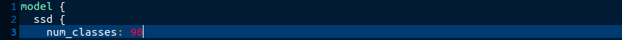
</p>

```diff
- batch_size(int, çift sayı olmalı):
    Bu değer, kullanılabilir belleğe göre ayarlanmalı, batch_size ne kadar yüksekse o kadar bellek gerekmektedir. 
    İlk başta hangi değer ile başlayacağımızı bilmiyorsanız batch_size: 8 olarak başlayabiliriz.
    Model eğitirken herhangi Bellek dışı Yazma, OOM(Out Of Memory) hatasını alırsak batch_size değerini
    azaltarak sorunu çözebiliriz.
```
<p align=center>  
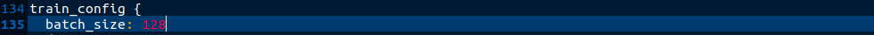
</p>

```diff
- fine_tune_checkpoint (str): 
      Burada önceden eğitilmiş modelin kontrol noktasının yolu verilir. Yaptığımız yapılandırmalara göre dosyanın yolu
      Tensorflow/workspace/pre_trained_models/<indirdiğimiz model dizininin adı>/checkpoint/ckpt-0 olmalıdır. 
```
<p align=center>  
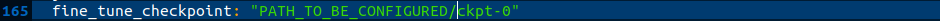
</p>

```diff
- fine_tune_checkpoint_type (str):
    Burada Nesne Detektörü Modeli eğittiğimiz için bu alanın değerini "detection" olarak değiştiriyoruz.
```
<p align=center>  
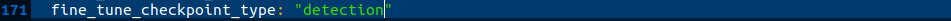
</p>

```diff
- label_map_path (str):
    Buraya daha önce oluşturduğumuz label_map.pbtxt dosyasının yolu verilir. 
    Bu parametre 2 yerde bulunmaktadır. İkisi de aynı değer almaktadır.
```
```diff
- train_input_reader -->  input_path:
    Bu alana train.tfrecord olarak cvattan indirdiğimiz tfrecord dosyasının yolunu veriyoruz.
```
```diff
- eval_input_reader -->  input_path:
    Bu alana test.tfrecord olarak cvattan indirdiğimiz tfrecord dosyasının yolunu veriyoruz.
```
**label_map.pbtxt**, **train.tfrecord** ve **test.tfrecord** dosyaları **training_demo/annotations** dizini altındadır.  
<p align=center>  
	Son 3 parametrelerin çıktıları böyle olmalıdır.
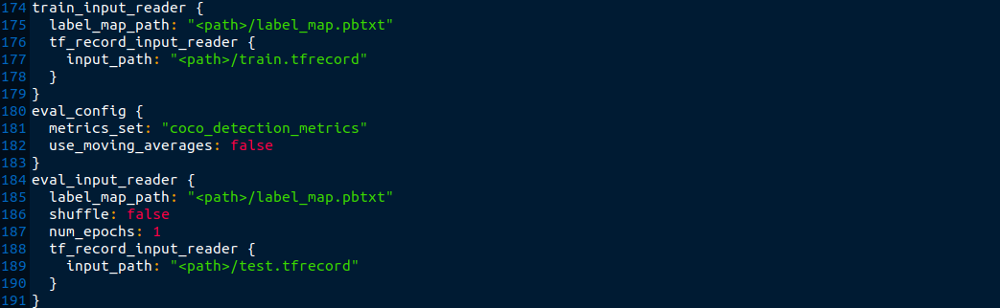
</p>

 ##### 8.5.2 Yapılandırma süreci: Gelişmiş
 - Yapılandırma dosyasındaki diğer parametrelerin ayarlanmasına nasıl yaklaşılır?  
 - Hangi parametre değerlerini denemeliyim?
 - Parametreler ve anlamları hakkında daha fazla bilgiyi nerede ve nasıl okuyabilirim?
 
 <p align=Center>
    
</p>  
Bu bölümde aklımıza takılabilen bu tür sorulara ışık tutmaya çalışacağız.  
Text editöründe **pipeline.config** dosyamımızı tekrandan açalım.   

```diff
- classification_loss
     Burada varsayılan sınıflandırma kayıp fonksiyonu olarak weight_sigmoid_focal fonksiyonu kullanılmıştır.
```
<p align=center>  
	<strong>Classification Loss </strong>
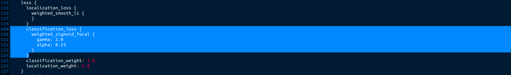
</p>

Şimdi mevcut diğer seçeneklere bakmaya çalışalım ve onlardan bir tanesini kullanalım.  
İyi hatırlıyorsak ilk adımlarda [TensorFlow API resimi github](https://github.com/tensorflow/models) hesabından models reposunu **TensorFlow** dizinine klonlamıştık.  
Şimdi bu dizinin alt dizin yollarını takip ederek ```losses.proto``` dosyamızı bulup açalım ve classification fonksiyonu bölümüne gidelim.
```diff
+ TensorFlow/models/research/object_detection/protos/losses.proto
```
 &nbsp;&nbsp;***losses.proto --> classification_loss function***
<p align=center>  
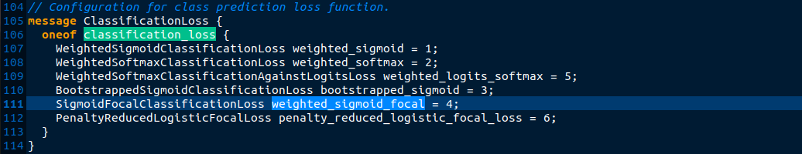
</p>

Yukarıda kod parçasından:
```diff
- classification_loss
      Bu parametre, değer olarak yukarıdaki önceden tanımlanmış seçeneklerden sadece bir tanesini alabilir. (oneof) 
```
Her parametre seçeneğinin kendi içsel parametreler vardır. Şimdi kayıp fonksiyonumuzu değiştirelim ve içsel parametrelerin nasıl değiştireceğimize de bakalım.  
Bizim varsayılan parametre `weight_sigmoid_focal` kayıp fonksiyonu idi şimdi onu `weighted_sigmoid` kayıp fonksiyonu ile değiştirelim.  
 &nbsp;&nbsp;***Yeni sınıflandırma Kayıp Fonksiyonu: weighted_sigmoid***
<p align=center>  
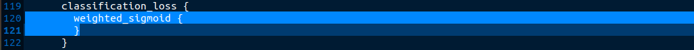
</p>
Bu fonksionun parametrelerini aynı `losses.proto` dosya içerisinde görebilirsiniz.  
 &nbsp;&nbsp;***weighted_sigmoid internal parameters***
<p align=center>  
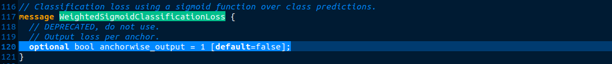
</p>
 
Örnek olarak kayıp fonksiyonu parametresine baktık. Aynı yaklaşımı kullanarak diğer parametreleri de değiştirebiliriz.  

 &nbsp;&nbsp; **Artık, modelimizi tam istediğimizi yapacak şekilde özelleştirebiliyoruz** :exclamation:

 <p align=Center>
    
</p>
<br/>	

### 9. Modeli Eğitme
Şimdi ```training_demo``` dizinine gidip ve ```tensorflow``` olarak oluşturduğumuz sanal ortamı aktifleştiriyoruz. Ardından ```model_main_tf2.py``` python betiğini uygun parametrelerle çalıştıralım.  
```
python3 model_main_tf2.py \
       --model_dir=models/my_ssd_mobilenet_v2_fpnlite \
       --pipeline_config_path=models/my_ssd_mobilenet_v2_fpnlite/pipeline.config
```
Betiği çalıştırırken bazı uyarıları alabiliriz ama bunlar hata değildir göz ardı edebiliriz.  
Herşey yolunda ise model eğitimi başladığında böyle bir çıktı almalıyız :clap:.
```
INFO:tensorflow:Step 500 per-step time 0.490s loss=0.257
I0124 15:51:03.956643 140032611187584 model_lib_v2.py:648] Step 500 per-step time 0.490s loss=0.257
```
Bu eğitim süresi kullandığımız sisteme, veri boyutu, batch_size, adım sayısı gibi bir çok faktöre bağlı olarak birçok dakika hatta saatler sürebilir.  
Burada gittikçe ```loss``` değerimizin azaldığını fark edebiliriz. Ama batch sayımız az olduğunda ```loss değeri```'nin değişim biraz dengesiz gözükebilir,
ama merak edecek bir şey yoktur. Step sayısı fazla ise zamanla düzenlenecektir. Bu eğitimde ```Step size``` yani adım sayısı 4000 olarak ayarladık.  
Eğer bu betiği çalıştırırken herhangi bir Out Of Memory(OOM) yani bellek dışına yazma hatasını alırsanız bunu eğitim hattı dosyamızdaki batch_size değeri azaltarak çözebilirsiniz. Model eğitilirken program kesmeyi isteyebiliriz, bunun için CTRL + C kullanabiliriz.  

### 10. Tensorboad ile Eğitim Sürecini İzleme
Bir önceki adımda örneğini verdiğimiz gibi model eğitilirken böyle bir çıktı almamız gerekir:  
```
I0124 15:50:15.607145 140032611187584 model_lib_v2.py:648] Step 400 per-step time 0.465s loss=0.259
INFO:tensorflow:Step 500 per-step time 0.490s loss=0.257
I0124 15:51:03.956643 140032611187584 model_lib_v2.py:648] Step 500 per-step time 0.490s loss=0.257
INFO:tensorflow:Step 600 per-step time 0.459s loss=0.278
I0124 15:51:51.727588 140032611187584 model_lib_v2.py:648] Step 600 per-step time 0.459s loss=0.278
INFO:tensorflow:Step 700 per-step time 0.453s loss=0.176
I0124 15:52:39.854391 140032611187584 model_lib_v2.py:648] Step 700 per-step time 0.453s loss=0.176
INFO:tensorflow:Step 800 per-step time 0.513s loss=0.984
I0124 15:53:28.495714 140032611187584 model_lib_v2.py:648] Step 800 per-step time 0.513s loss=0.984
INFO:tensorflow:Step 900 per-step time 0.491s loss=0.715
I0124 15:54:16.864622 140032611187584 model_lib_v2.py:648] Step 900 per-step time 0.491s loss=0.715
INFO:tensorflow:Step 1000 per-step time 0.480s loss=0.217
I0124 15:55:05.613072 140032611187584 model_lib_v2.py:648] Step 1000 per-step time 0.480s loss=0.217
INFO:tensorflow:Step 1100 per-step time 0.478s loss=0.221
I0124 15:55:54.162772 140032611187584 model_lib_v2.py:648] Step 1100 per-step time 0.478s loss=0.221
INFO:tensorflow:Step 1200 per-step time 0.496s loss=0.219
I0124 15:56:43.114429 140032611187584 model_lib_v2.py:648] Step 1200 per-step time 0.496s loss=0.219
INFO:tensorflow:Step 1300 per-step time 0.506s loss=0.344
I0124 15:57:31.940711 140032611187584 model_lib_v2.py:648] Step 1300 per-step time 0.506s loss=0.344
INFO:tensorflow:Step 1400 per-step time 0.494s loss=0.392
I0124 15:58:20.282603 140032611187584 model_lib_v2.py:648] Step 1400 per-step time 0.494s loss=0.392
INFO:tensorflow:Step 1500 per-step time 0.497s loss=0.202
I0124 15:59:09.041602 140032611187584 model_lib_v2.py:648] Step 1500 per-step time 0.497s loss=0.202
INFO:tensorflow:Step 1600 per-step time 0.499s loss=0.177
I0124 15:59:57.839989 140032611187584 model_lib_v2.py:648] Step 1600 per-step time 0.499s loss=0.177
INFO:tensorflow:Step 1700 per-step time 0.531s loss=0.185
I0124 16:00:46.207504 140032611187584 model_lib_v2.py:648] Step 1700 per-step time 0.531s loss=0.185
```
Bu çıktıdan anlamamız gereken önemli noktalar ise ```loss``` yani bir önceki güncelleme sonuncuda elde edilen yeni ```kayıp değeri```'dir, ikincisi ise ```Step sayısı``` bu da kaçıncı adımda olduğumuzu göstermektedir.  
Bu bilgileri her birkaç dakikada bir **Tensorboard**'a kaydedilmektedir.  
Tensorboard ile bu çıktıları görselleştirmek için **training_demo** dizinimizde terminal açıp bu komutu çalıştıralım:  
```
tensorboard --logdir models/my_ssd_mobilenet_v2_fpnlite/
```
<p align=center>  
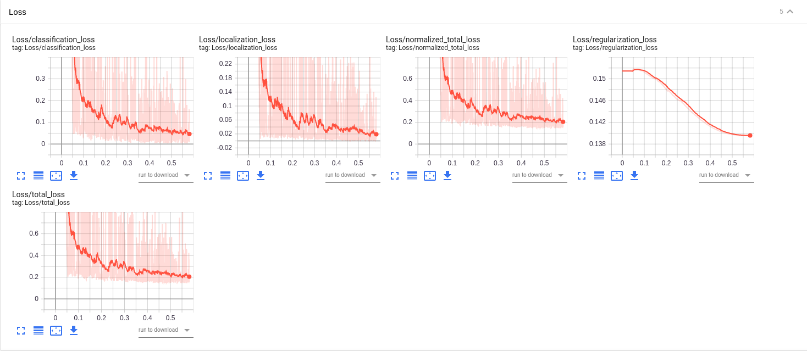
		Tensorboard Kayıp Fonksiyonunun Grafikleri
</p>

Eğitim betiği, kontrol noktaları her birkaç dakikada bir kaydetmektedir. Eğitim sürecini kontrolda sayısal olarak ya da tensorboard'da  
görsel olarak takip edebileceğimiz için model tatmin edici bir seviyeye ulaştığında CTRL + C ile eğitimi durdurabiliriz. Ya da eğitimi tamamlana kadar bekleriz.

Eğitim sürecinde model tatmin edici bir saviyeye ulaştığında CTRL + C ile kesebiliriz ya da tamamlanmasını bekleyebiliriz.  

***Bonus:***  [Uzaktan serverden Tensorboard çalıştırma](https://stackoverflow.com/questions/37987839/how-can-i-run-tensorboard-on-a-remote-server)  


### 11. Eğitilmiş Modelimizin Çıkarım Grafiğini Dışa Aktarma
Model eğitimi bitirdikten sonra, modelimizi çıkartabiliriz. Bunun için **trainikng_demo** dizininde olalım. Şimdi bu dizinde bulunan çıkartma betiğini çalıştıralım. 
```
python3 exporter_main_v2.py 
         --input_type image_tensor    \
         --pipeline_config_path   models/my_ssd_mobilenet_v2_fpnlite/pipeline.config  \
         --trained_checkpoint_dir models/my_ssd_mobilenet_v2_fpnlite  \
         --output_directory  exported-models/my_mobilenet_model
```
**Argümanlar:**  
- *```--trained_checkpoint_dir```* = eğittiiğimiz model kontrol noktaların bulunduğu dizin.  
- *```--output_directory```* = Eğittiğimiz modelin Çıkarım grafiğinin çıkarılacağı dizin.  

Çıkartma işleminin sonucunda çıktının son satırları böyle olmalıdır.  
```
INFO:tensorflow:Writing pipeline config file to exported-models/my_mobilenet_model/pipeline.config
I0124 17:33:28.966995 140499388091264 config_util.py:253] Writing pipeline config file to exported-models/my_mobilenet_model/pipeline.config
```
Ya da *`TypeError:Expected Operation, Variable, or Tensor, got block4 in exporter_main_v2.py`* gibi bir hata alırsanız bu hata 
[konusuna](https://github.com/tensorflow/models/issues/8881) bakabilirsiniz.  
Şimdi eğer her şey başarılı bir şekilde sonlandıysa modelimiz **training_demo/exported-models/my_mobilenet_model/saved_model** dizini altında olacaktır. Burada söz konusu olan *çıkartma grafiği (Inference graph)* bu dizinde *`saved_model.pb`* olarak bulunacaktır.  
Bu graf dosyasının yanında label_map.pbtxt dosyasını da kopyalayabiliriz.  

### 12. Modeli Değerlendirme
IoU, mAP, Recall ve Precision gibi model metriklerini ölçmek istiyorsak, bu adımı tamamlayabiliriz. Modeli değerlendirmek için en güncel TensorFlow Dokümantasyonu [burada](https://github.com/tensorflow/models/blob/master/research/object_detection/g3doc/tf2_training_and_evaluation.md#evaluation) bulabiliriz.  
Şimdi ```TensorFlow/workspace/training_demo``` dizininde terminali açıp bu komutu çalıştıralım.

```
python3 model_main_tf2.py   \
         --pipeline_config_path  models/my_ssd_mobilenet_v2_fpnlite/pipeline.config   \
         --model_dir  models/my_ssd_mobilenet_v2_fpnlite       \
         --checkpoint_dir  models/my_ssd_mobilenet_v2_fpnlite  \
         --alsologtostderr
```
Ve her şey yolunda ise böyle bir çıktı almalıyız.  
```
Evaluate annotation type *bbox*
DONE (t=0.03s).
Accumulating evaluation results...
DONE (t=0.01s).
 Average Precision  (AP) @[ IoU=0.50:0.95 | area=   all | maxDets=100 ] = 0.911
 Average Precision  (AP) @[ IoU=0.50      | area=   all | maxDets=100 ] = 1.000
 Average Precision  (AP) @[ IoU=0.75      | area=   all | maxDets=100 ] = 1.000
 Average Precision  (AP) @[ IoU=0.50:0.95 | area= small | maxDets=100 ] = -1.000
 Average Precision  (AP) @[ IoU=0.50:0.95 | area=medium | maxDets=100 ] = -1.000
 Average Precision  (AP) @[ IoU=0.50:0.95 | area= large | maxDets=100 ] = 0.911
 Average Recall     (AR) @[ IoU=0.50:0.95 | area=   all | maxDets=  1 ] = 0.522
 Average Recall     (AR) @[ IoU=0.50:0.95 | area=   all | maxDets= 10 ] = 0.928
 Average Recall     (AR) @[ IoU=0.50:0.95 | area=   all | maxDets=100 ] = 0.928
 Average Recall     (AR) @[ IoU=0.50:0.95 | area= small | maxDets=100 ] = -1.000
 Average Recall     (AR) @[ IoU=0.50:0.95 | area=medium | maxDets=100 ] = -1.000
 Average Recall     (AR) @[ IoU=0.50:0.95 | area= large | maxDets=100 ] = 0.928
INFO:tensorflow:Eval metrics at step 4000
I0124 18:07:27.609810 139935346711424 model_lib_v2.py:954] Eval metrics at step 4000
INFO:tensorflow:	+ DetectionBoxes_Precision/mAP: 0.910781
I0124 18:07:27.613544 139935346711424 model_lib_v2.py:957] 	+ DetectionBoxes_Precision/mAP: 0.910781
INFO:tensorflow:	+ DetectionBoxes_Precision/mAP@.50IOU: 1.000000
I0124 18:07:27.614520 139935346711424 model_lib_v2.py:957] 	+ DetectionBoxes_Precision/mAP@.50IOU: 1.000000
INFO:tensorflow:	+ DetectionBoxes_Precision/mAP@.75IOU: 1.000000
I0124 18:07:27.615149 139935346711424 model_lib_v2.py:957] 	+ DetectionBoxes_Precision/mAP@.75IOU: 1.000000
INFO:tensorflow:	+ DetectionBoxes_Precision/mAP (small): -1.000000
I0124 18:07:27.615848 139935346711424 model_lib_v2.py:957] 	+ DetectionBoxes_Precision/mAP (small): -1.000000
INFO:tensorflow:	+ DetectionBoxes_Precision/mAP (medium): -1.000000
I0124 18:07:27.616371 139935346711424 model_lib_v2.py:957] 	+ DetectionBoxes_Precision/mAP (medium): -1.000000
INFO:tensorflow:	+ DetectionBoxes_Precision/mAP (large): 0.910781
I0124 18:07:27.616978 139935346711424 model_lib_v2.py:957] 	+ DetectionBoxes_Precision/mAP (large): 0.910781
INFO:tensorflow:	+ DetectionBoxes_Recall/AR@1: 0.522222
I0124 18:07:27.617634 139935346711424 model_lib_v2.py:957] 	+ DetectionBoxes_Recall/AR@1: 0.522222
INFO:tensorflow:	+ DetectionBoxes_Recall/AR@10: 0.927778
I0124 18:07:27.618317 139935346711424 model_lib_v2.py:957] 	+ DetectionBoxes_Recall/AR@10: 0.927778
INFO:tensorflow:	+ DetectionBoxes_Recall/AR@100: 0.927778
I0124 18:07:27.618904 139935346711424 model_lib_v2.py:957] 	+ DetectionBoxes_Recall/AR@100: 0.927778
INFO:tensorflow:	+ DetectionBoxes_Recall/AR@100 (small): -1.000000
I0124 18:07:27.619540 139935346711424 model_lib_v2.py:957] 	+ DetectionBoxes_Recall/AR@100 (small): -1.000000
INFO:tensorflow:	+ DetectionBoxes_Recall/AR@100 (medium): -1.000000
I0124 18:07:27.620136 139935346711424 model_lib_v2.py:957] 	+ DetectionBoxes_Recall/AR@100 (medium): -1.000000
INFO:tensorflow:	+ DetectionBoxes_Recall/AR@100 (large): 0.927778
I0124 18:07:27.620743 139935346711424 model_lib_v2.py:957] 	+ DetectionBoxes_Recall/AR@100 (large): 0.927778
INFO:tensorflow:	+ Loss/localization_loss: 0.011876
I0124 18:07:27.621258 139935346711424 model_lib_v2.py:957] 	+ Loss/localization_loss: 0.011876
INFO:tensorflow:	+ Loss/classification_loss: 0.075007
I0124 18:07:27.621790 139935346711424 model_lib_v2.py:957] 	+ Loss/classification_loss: 0.075007
INFO:tensorflow:	+ Loss/regularization_loss: 0.142810
I0124 18:07:27.622501 139935346711424 model_lib_v2.py:957] 	+ Loss/regularization_loss: 0.142810
INFO:tensorflow:	+ Loss/total_loss: 0.229693
I0124 18:07:27.623046 139935346711424 model_lib_v2.py:957] 	+ Loss/total_loss: 0.229693
INFO:tensorflow:Waiting for new checkpoint at models/my_ssd_mobilenet_v2_fpnlite
I0124 18:12:08.746780 139935346711424 checkpoint_utils.py:125] Waiting for new checkpoint at models/my_ssd_mobilenet_v2_fpnlite
```
### Video Üzerinde Modeli Deneme
```
python3 tf-video.py --video test.mp4  --threshold 0.85
```


